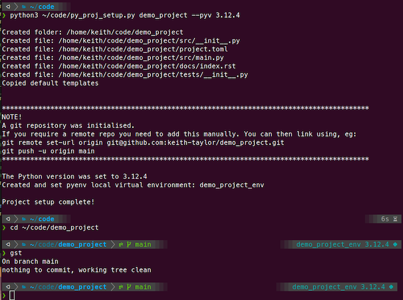

# repo_name

This script aims to take some of the work out of initialising a Python project. It will:
- create the folders and blank files specified in the `files_and_folders_list`
- create a README.md file using default images to liven the aesthetics up a bit
- create a `pyenv virtualenv` 
- and set the local Python version to either: 
  - the default Python version, or 
  - the one you specify using the `--pyv` argument
- add a default .gitignore file
- run `git init` and take care of your first commit 
- remind you of the commands to link you local git repo to a GitHub remote repo

It assumes that you're using:
- `pyenv` to manage your Python versions
- `pyenv virtualenv` to manage Python environments (cf. `venv`)
- `git` to manage versioning
- `git-hub` for remote repos

#### Installation

Clone from: `git@github.com:keith-taylor/py_proj_setup.git`

#### Contact

 `@_thinkmachines_`

 https://github.com/keith-taylor 

 

 

